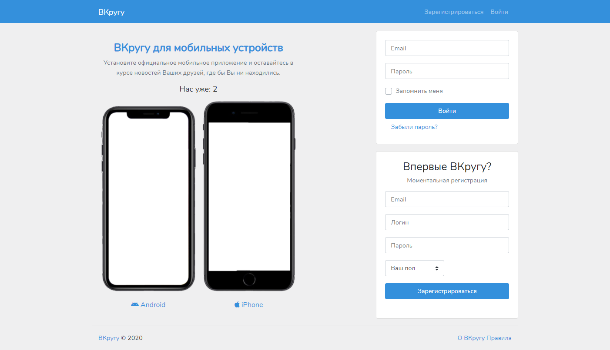
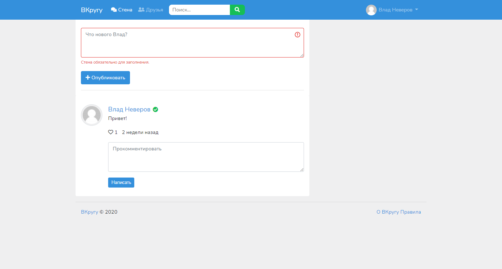

# Social Network [Laravel]

A small social network demo.

**Laragon Lite 4.0.15**  
**PHP 7.4.15**  
**Node.js 14.17.0**    
**MySQL 8.0.20**  
**Apache 2.4.35**  
**Laravel 8**  
 `#3490dc`




## Install
cd project
`composer install` (see folder **vendor**)

cd project
`npm install` (see folder **node_modules**)

clone `.env.example` and rename to `.env`

Generate APP_KEY
`php artisan key:generate`

Create symbolic link
`php artisan storage:link`

## Connection to DataBase `.env`
```
DB_CONNECTION=mysql
DB_HOST=localhost
DB_PORT=3306
DB_DATABASE=Your db name
DB_USERNAME=Your username
DB_PASSWORD=Your password
```

## Running Migrations
```
php artisan migrate
php artisan db:seed
```

## Connection to Mailtrap `.env`
```
MAIL_DRIVER=smtp
MAIL_HOST=smtp.mailtrap.io
MAIL_PORT=2525
MAIL_USERNAME=Your username
MAIL_PASSWORD=Your password
MAIL_ENCRYPTION=null
MAIL_FROM_ADDRESS=network@social.com
MAIL_FROM_NAME="${APP_NAME}"
```

## Login
admin@social.com  
admin
